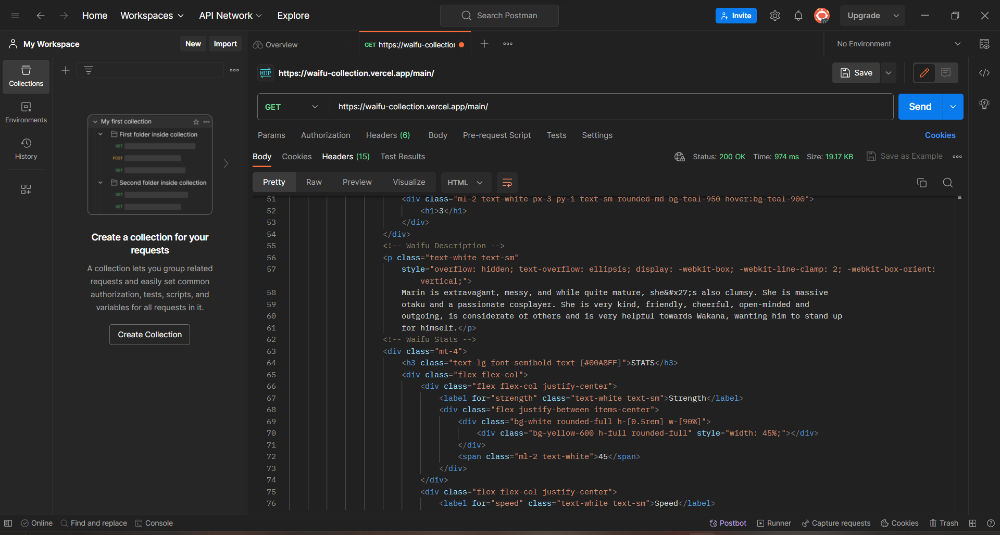
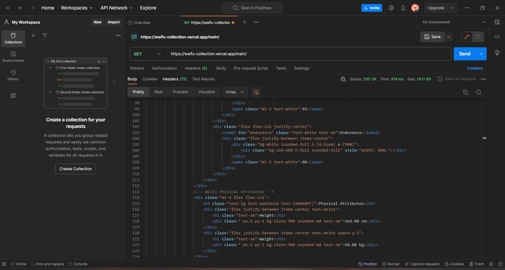
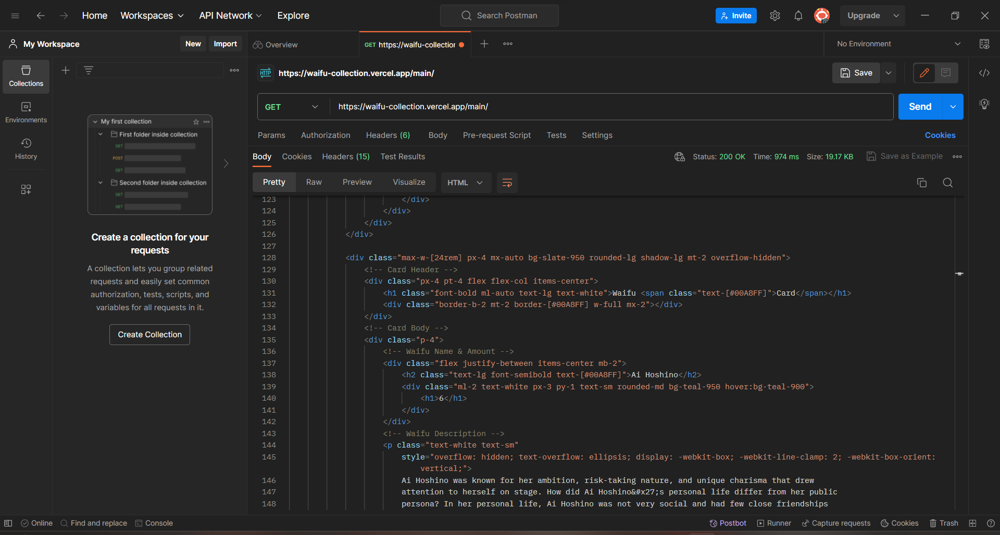
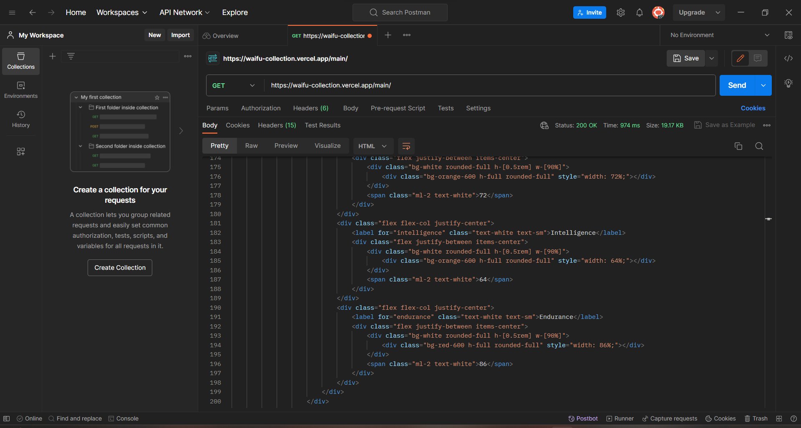
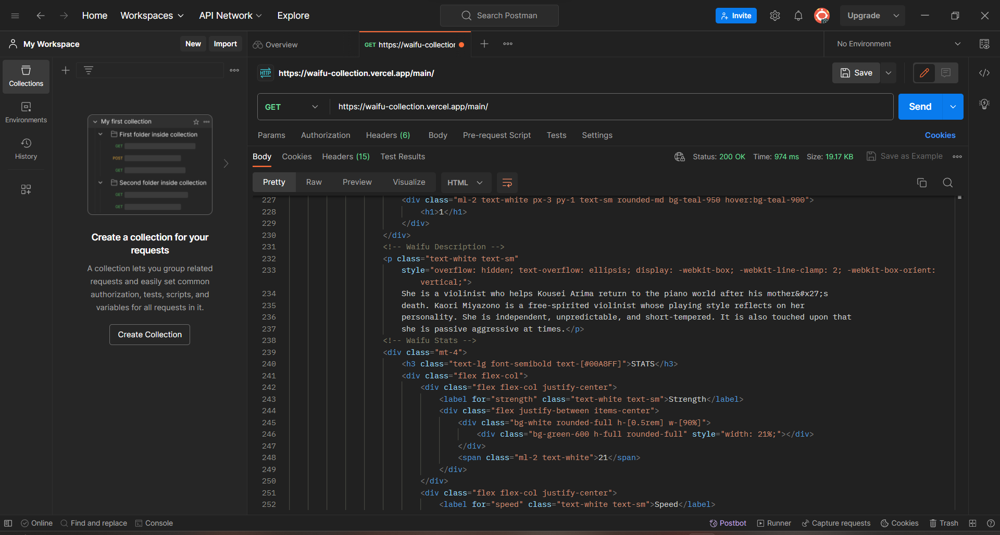
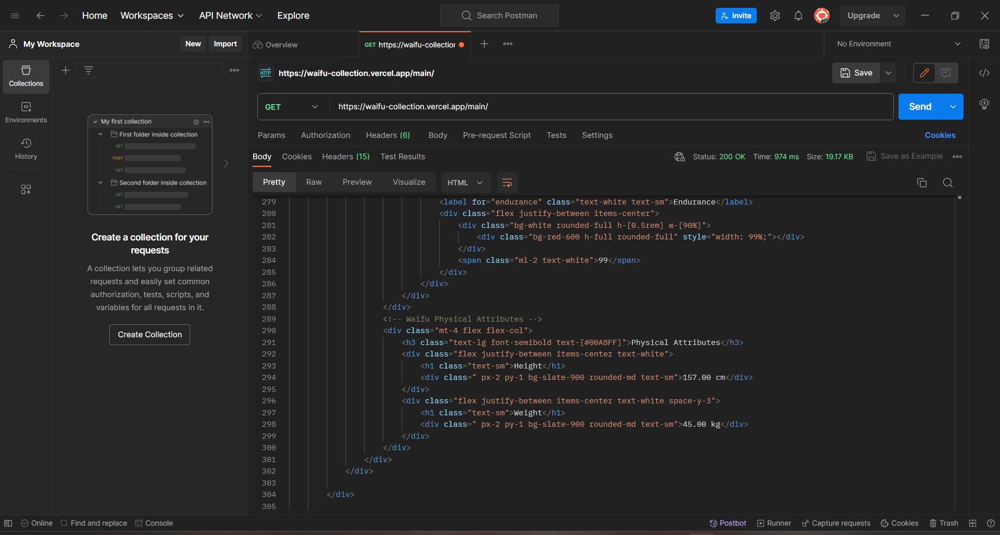
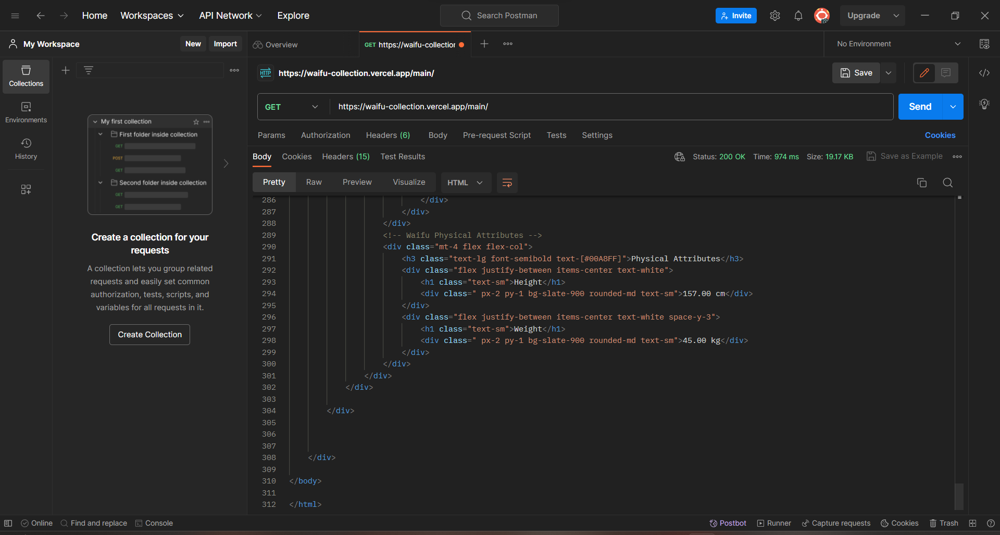
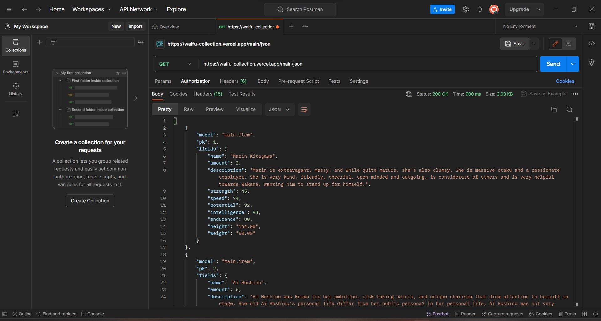
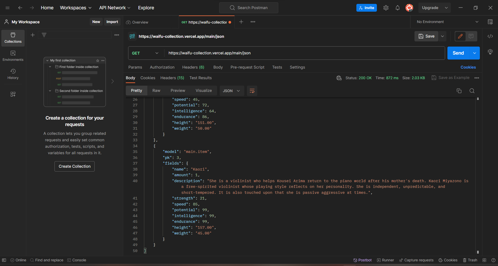

TUGAS 3
deployment: https://waifu-collection.vercel.app/

1.
Ketika menggunakan Form Post atau post request, data yang dikirimkan ke server dibungkus dalam body milik request tersebut sehingga data tidak terlihat oleh pihak ketiga. Sementara itu, pada Form Get atau get request, data yang dikirimkan ke server menjadi bagian Head atau kepala dari request tersebut dan data tersebut terlihat di URL yang mana dapat dilihat oleh pihak ketiga. Meskipun keduanya dapat dilakukan untuk hal yang sama, akan tetapi berdasarkan konvensi keduanya memiliki peruntukan yang berbeda. Form Post digunakan untuk mengirim data yang tujuannya untuk memodifikasi database sementara Form Get hanya untuk mendapatkan data yang sifatnya tidak sensitif dan tidak pula mengubah status. Form get cenderung lebih cepat daripada form post karena tidak memiliki overhead alias datanya terpusat di bagian head saja. Selain itu, Get Request dapat di-cache oleh browser sementara  Post Request tidak dapat dicache oleh browser.

2.
Perbedaan utama diantara ketiganya sebagai berikut:
XML
XML berbentuk markup language dengan tag yang dapat kita buat sendiri. XML menerapkan struktur atau disebut juga struktur hierarkis dalam mengorganisir datanya. XML tidak memiliki tipe data default sehingga mudah diuraikan dan fleksibel untuk dikonversi ke bentuk objek lainnya.

JSON
JSON merepresentasikan data dalam bentuk objek javascript yang mirip seperti map atau dicitionary. JSON mengorganisir datanya dengan menggunakan value-key pair atau dengan kata lain menggunakan struktur map. Tidak hanya itu JSON juga memiliki ukuran file yang lebih kecil dari format data lain sehingga hal ini menyebabkan JSON memiliki performa yang lebih baik daripada XML. Meskipun tidak se-fleksibel XML tetapi JSON sendiri sudah cukup mendukung banyak struktur data maupun objek.

HTML
Html sebenarnya merupakan markup language yang lebih diperuntukkan untuk membuat tampilan dan konten dari suatu website daripada menjadi format pengiriman data. Tag pada html juga sudah default dari sananya dan kita tidak bisa membuat custom tag sendiri.

3.
JSON memiliki Sintaks yang Mudah Dibaca
JSON memiliki sintaknya yang ringkas dan mudah dibaca oleh manusia. JSON menggunakan format objek dengan pasangan "kunci-nilai" yang intuitif dan mudah dinterpretasikan oleh manusia.

Mudah Diproses
JSON mudah diproses oleh komputer. Kebanyakan bahasa pemrograman modern memiliki dukungan yang baik untuk parsing dan menghasilkan data dalam format JSON. Ini membuatnya mudah untuk mengubah data dalam format JSON menjadi objek atau struktur data yang dapat digunakan oleh aplikasi.

Mendukung Tipe Data yang Umum
JSON mendukung tipe data umum seperti string, angka, boolean, objek, dan array. Ini mencakup sebagian besar tipe data yang diperlukan dalam pertukaran data.

Kompabilitas Tinggi
JSON mendukung berbagai bahasa pemrograman. Hampir semua bahasa pemrograman modern memiliki dukungan untuk mengurai (parsing) dan menghasilkan data dalam format JSON. Ini membuatnya sangat cocok untuk berkomunikasi antara berbagai aplikasi dan sistem yang ditulis dalam bahasa yang berbeda.

4.
Langkah-langkahnya sebagai berikut:

a. Membuat base.html

```plaintext

<!DOCTYPE html>
<html lang="en">
    <head>
        <meta charset="UTF-8" />
        <meta
            name="viewport"
            content="width=device-width, initial-scale=1.0"
        />
        <script src="https://cdn.tailwindcss.com"></script>
        
        
    </head>


    <body class="bg-slate-900">
        
        
    </body>
</html>
```
base.html ini diletakkan di folder templates yang berada di root directory.

b. Tambahkan fungsi create_card di views.py pada directory aplikasi main
Kode fungsi tersebut adalah sebagai berikut
```
def create_card(request):
    if request.method == 'POST':
        name = request.POST.get('name')
        amount = request.POST.get('amount')
        description = request.POST.get('description')
        strength = request.POST.get('strength')
        speed = request.POST.get('speed')
        potential = request.POST.get('potential')
        intelligence = request.POST.get('intelligence')
        endurance = request.POST.get('endurance')
        height = request.POST.get('height')
        weight = request.POST.get('weight')
        item = Item(
            name=name,
            amount=amount,
            description=description,
            strength=strength,
            speed=speed,
            potential=potential,
            intelligence=intelligence,
            endurance=endurance,
            height=height,
            weight=weight,
        )
        item.save()
        return redirect('main:home')


    return render(request, "addCard.html",{})
```
Fungsi tersebut memiliki parameter request yang berasal dari routing permintaan client di urls.py yang berada di tingkat project dan app (main). Fungsi tersebut menangani permintaan GET dan POST. Apabila permintaan berupa POST maka kita akan mengambil nilai-nilai yang tersimpan di body request tersebut dan kemudian menjadikannya sebagai instance dari model Item untuk selanjutnya disimpan ke db (database). Sementara itu, apabila permintaan berupa GET maka kita akan me-render template addCard.html

c. Membuat fungsi untuk menampilkan data dalam HTML, XML, JSON, XML by ID, dan JSON by ID
Kodenya adalah sebagai berikut
```
from django.shortcuts import render, redirect
from .models import Item
from django.http import HttpResponse
from django.core import serializers


def create_card(request):
    if request.method == 'POST':
        name = request.POST.get('name')
        amount = request.POST.get('amount')
        description = request.POST.get('description')
        strength = request.POST.get('strength')
        speed = request.POST.get('speed')
        potential = request.POST.get('potential')
        intelligence = request.POST.get('intelligence')
        endurance = request.POST.get('endurance')
        height = request.POST.get('height')
        weight = request.POST.get('weight')
        item = Item(
            name=name,
            amount=amount,
            description=description,
            strength=strength,
            speed=speed,
            potential=potential,
            intelligence=intelligence,
            endurance=endurance,
            height=height,
            weight=weight,
        )
        item.save()
        return redirect('main:home')


    return render(request, "addCard.html",{})


# Menambahkan fungsi untuk melihat kartu yang telah ditambahkan

def home(request):
    waifus = Item.objects.all()
    card_total = 0
    for waifu in waifus:
        card_total += waifu.amount
    return render(request, "home.html", {'waifus': waifus, 'total':card_total})

def show_xml_by_id(request, id):
    data = Item.objects.filter(pk=id)
    return HttpResponse(serializers.serialize("xml", data), content_type="application/xml")
def show_json_by_id(request, id):
    data = Item.objects.filter(pk=id)
    return HttpResponse(serializers.serialize("json", data), content_type="application/json")
def show_json(request):
    data = Item.objects.all()
    return HttpResponse(serializers.serialize("json", data), content_type="application/json")
def show_xml(request):
    data = Item.objects.all()
    return HttpResponse(serializers.serialize("xml", data), content_type="application/xml")
```

d. Mengupdate routing pada tingkat app main
Kodenya adalah sebagai berikut
```
from django.urls import path
from .views import home, create_card, show_json_by_id, show_xml_by_id, show_json, show_xml
app_name = 'main'
urlpatterns = [
    path('', home, name='home'), 
    path('addCard/', create_card, name='addCard'),
    path('json/', show_json, name='show_json'), 
    path('xml/', show_xml, name='show_xml'),
    path('xml/<int:id>/', show_xml_by_id, name='show_xml_by_id'),
    path('json/<int:id>/', show_json_by_id, name='show_json_by_id'),
  ]
```
Routing ini dilakukan di urls.py pada tingkat direktori app main. Hal tersebut agar request yang masuk dapat dimapping ke fungsi views yang sesuai.

e. Memodifikasi main.html
Buat modifikasi pada template home.html dengan melakukan inheritance terhadap template base.html. Selain itu kita juga perlu menambahkan sebuah button di ujung kanan atas untuk mengarahkan kita ke halaman form membuat kartu. Kode untuk home.html adalah sebagai berikut
```



    
    <title>Waifu Card Collection</title>
    
    
    
    
    <div class="w-screen min-h-screen flex flex-col">
        <div class=" hidden md:flex fixed right-0 top-0 h-screen w-3/4 bg-blue-700 -z-20" style="clip-path: polygon(100% 0%, 100% 100%, 0% 100%, 80% 0%);">
        </div>
        <a href="" class="fixed top-2 right-2 text-white px-4 py-2 text-base rounded-md bg-slate-950 hover:bg-teal-900">
            <h1>Tambah Kartu</h1>
        </a>
        <div class="flex flex-col w-full text-base p-4 text-white font-bold ">
            <div class="  p-4 rounded-md bg-opacity-30 text-base">
                <h1>Nama Aplikasi: <span class="text-[#00A8FF]">Waifu Card Collection</span></h1>
            <h1>Nama: <span class="text-[#00A8FF]">Isa Citra Buana</span></h1>
            <h1>NPM: <span class="text-[#00A8FF]">2206081465</span></h1>
            <h1>Kelas: <span class="text-[#00A8FF]">PBP D</span></h1>
            </div>
            <div class=" mx-auto mt-4 text-white font-bold text-base ">
                <h1>Terdapat <span class="text-[#00A8FF]">{{total}} kartu waifu </span></h1>
            </div>


        </div>
        
        
            <div class="flex w-full justify-center text-sm md:text-base lg:text-lg text-white font-bold h-full items-center">
                <h1> Belum ada waifu. Silahkan menambahkan</h1>
            </div>
        
            <div class="mb-4  mx-auto gap-4 grid grid-cols-1 md:grid-cols-2 lg:grid-cols-3 justify-center ">
            
            <div class="max-w-[24rem] px-4 mx-auto bg-slate-950 rounded-lg shadow-lg mt-2 overflow-hidden">
                <!-- Card Header -->
                <div class="px-4 pt-4 flex flex-col items-center">
                    <h1 class="font-bold ml-auto text-lg text-white">Waifu <span class="text-[#00A8FF]">Card</span></h1>
                    <div class="border-b-2 mt-2 border-[#00A8FF] w-full mx-2"></div>
                </div>
                <!-- Card Body -->
                <div class="p-4">
                    <!-- Waifu Name & Amount -->
                    <div class="flex justify-between items-center mb-2">
                        <h2 class="text-lg font-semibold text-[#00A8FF]">{{ data.name }}</h2>
                        <div class="ml-2 text-white px-3 py-1 text-sm rounded-md bg-teal-950 hover:bg-teal-900">
                            <h1>{{ data.amount }}</h1>
                        </div>
                    </div>
                    <!-- Waifu Description -->
                    <p class="text-white text-sm" style="overflow: hidden; text-overflow: ellipsis; display: -webkit-box; -webkit-line-clamp: 2; -webkit-box-orient: vertical;">{{ data.description }}</p>
                    <!-- Waifu Stats -->
                    <div class="mt-4">
                        <h3 class="text-lg font-semibold text-[#00A8FF]">STATS</h3>
                        <div class="flex flex-col">
                            <div class="flex flex-col justify-center">
                                <label for="strength" class="text-white text-sm">Strength</label>
                                <div class="flex justify-between items-center">
                                    <div class="bg-white rounded-full h-[0.5rem] w-[90%]">
                                        <div class="bg-green-600yellow-600orange-600red-600 h-full rounded-full" style="width: {{ data.strength }}%;"></div>
                                    </div>
                                    <span class="ml-2 text-white">{{ data.strength }}</span>
                                </div>
                            </div>
                            <div class="flex flex-col justify-center">
                                <label for="speed" class="text-white text-sm">Speed</label>
                                <div class="flex justify-between items-center">
                                    <div class="bg-white rounded-full h-[0.5rem] w-[90%]">
                                        <div class="bg-green-600yellow-600orange-600red-600 h-full rounded-full" style="width: {{ data.speed }}%;"></div>
                                    </div>
                                    <span class="ml-2 text-white">{{ data.speed }}</span>
                                </div>
                            </div>
                            <div class="flex flex-col justify-center">
                                <label for="potential" class="text-white text-sm">Potential</label>
                                <div class="flex justify-between items-center">
                                    <div class="bg-white rounded-full h-[0.5rem] w-[90%]">
                                        <div class="bg-green-600yellow-600orange-600red-600 h-full rounded-full" style="width: {{ data.potential }}%;"></div>
                                    </div>
                                <span class="ml-2 text-white">{{ data.potential }}</span>
                                </div>
                            </div>
                            <div class="flex flex-col justify-center">
                                <label for="intelligence" class="text-white text-sm">Intelligence</label>
                                <div class="flex justify-between items-center">
                                    <div class="bg-white rounded-full h-[0.5rem] w-[90%]">
                                        <div class="bg-green-600yellow-600orange-600red-600 h-full rounded-full" style="width: {{ data.intelligence }}%;"></div>
                                    </div>
                                    <span class="ml-2 text-white">{{ data.intelligence }}</span>
                                </div>
                            </div>
                            <div class="flex flex-col justify-center">
                                <label for="endurance" class="text-white text-sm">Endurance</label>
                                <div class="flex justify-between items-center">
                                    <div class="bg-white rounded-full h-[0.5rem] w-[90%]">
                                        <div class="bg-green-600yellow-600orange-600red-600 h-full rounded-full" style="width: {{ data.endurance }}%;"></div>
                                    </div>
                                    <span class="ml-2 text-white">{{ data.endurance }}</span>
                                </div>
                            </div>
                        </div>
                    </div>
                    <!-- Waifu Physical Attributes -->
                    <div class="mt-4 flex flex-col">
                        <h3 class="text-lg font-semibold text-[#00A8FF]">Physical Attributes</h3>
                        <div class="flex justify-between items-center text-white">
                            <h1 class="text-sm">Height</h1>
                            <div class=" px-2 py-1 bg-slate-900 rounded-md text-sm">{{ data.height }} cm</div>
                        </div>
                        <div class="flex justify-between items-center text-white space-y-3">
                            <h1 class="text-sm">Weight</h1>
                            <div class=" px-2 py-1 bg-slate-900 rounded-md text-sm">{{ data.weight }} kg</div>
                        </div>
                    </div>
                </div>
            </div>
            
        </div>
        
    </div>
    
```

f. Menambahkan addCard.html pada folder templates di tingkat direktori app main
Buat template addCard.html dengan melakukan inheritance terhadap base.html . Selanjutnya tambahkan tag form dengan atribut method yaitu post dan atribut action string kosong. Hal ini bertujuan agar form tersebut dikirimkan ke url yang sedang kita buka saat ini yaitu ." .../addCard ". Selanjutnya tambahkan  di dalam tag form tersebut. Pastikan kita harus membuat semua input yang dibutuhkan beserta atribut type yang sesuai. Selain itu kita juga harus memastikan atribut name sesuai dengan nama field pada model yang sedang kita tuju, dalam hal ini model Item. Terakhir tambahkan input bertipe submit agar ketika ditekan maka form dapat terkirim. Kodenya adalah sebagai berikut
```



<title>Tambah Kartu</title>



<div class=" hidden md:flex fixed right-0 top-0 h-screen w-3/4 bg-blue-700 -z-20" style="clip-path: polygon(100% 0%, 100% 100%, 0% 100%, 80% 0%);">
</div>
<div class="hidden fixed md:flex justify-end items-end w-screen h-screen -z-10 ">
    
</div>
<div class=" w-screen  min-h-screen flex lg:-ml-8 justify-center lg:justify-center md:justify-start items-center text-white">
    <div class= "flex flex-col items-center">
        <h1 class="mt-6 text-white text-4xl font-bold font-sans"> Tambah <span class="text-[#00A8FF]">Kartu Waifu</span></h1>
        <div class=" mt-4 md:mt-8 bg-slate-950 px-4 max-w-[95%] mx-2 md:min-w-[36rem] py-2 rounded-md">
            <form method="POST" action="">
                
               
               <div class=" grid grid-cols-4 gap-4">
                <div class=" flex-col flex md:col-span-2 col-span-3">
                    <label for="name" class=" text-white mb-2 text-sm">Nama Waifu</label>
                    <input for="name" name="name" id="name" class="bg-slate-800 focus:border  text-white  text-sm rounded-xs focus:ring-blue-500 focus:border-blue-500 block w-full p-2.5" type="text" placeholder="Nama waifu idamanmu" required>
                </div>
                <div class="mb-2 md:col-span-2 col-span-1">
                    <label for="amount" class="block text-white text-sm mb-2">Amount</label>
                    <input
                    required
                        type="number"
                        id="amount"
                        name="amount"
                        min="1"
                        max="100"
                        step="1"
                        placeholder="Jumlah"
                        class="bg-slate-800 focus:border  text-white  text-sm rounded-xs focus:ring-blue-500 focus:border-blue-500 block w-full p-2.5"
                    >
                </div>
               </div>
                <div class=" grid-cols-2 md:grid gap-4">


                    <div class=" flex flex-col">
                        <label class="mt-2  mb-2 text-sm" for="strength">Strength</label>
                        <div class=" flex justify-between">
                            <input
                        required
                        class =" w-[90%]"
                        type="range"
                        id="strength"
                        name="strength"
                        min="1"
                        max="100"
                        step="1"
                        value="50"
                        oninput="updateOutput(this.value, 'strength-value'); "
                        >
                        <output for="strength" id="strength-value">50</output>
                        </div>
                    </div>


                    <div class=" flex flex-col">
                        <label class="mt-2  mb-2 text-sm" for="speed">Speed</label>
                        <div class=" flex justify-between">
                            <input
                        required
                        class =" w-[90%]"
                        type="range"
                        id="speed"
                        name="speed"
                        min="1"
                        max="100"
                        step="1"
                        value="50"
                        oninput="updateOutput(this.value, 'speed-value'); "
                        >
                        <output for="speed" id="speed-value">50</output>
                        </div>
                    </div>


                    <div class=" flex flex-col">
                        <label class="mt-2  mb-2 text-sm" for="intelligence">Intelligence</label>
                        <div class=" flex justify-between">
                            <input
                        required
                        class =" w-[90%]"
                        type="range"
                        id="intelligence"
                        name="intelligence"
                        min="1"
                        max="100"
                        step="1"
                        value="50"
                        oninput="updateOutput(this.value, 'intelligence-value')"
                        >
                        <output for="intelligence" id="intelligence-value">50</output>
                        </div>
                    </div>


                    <div class=" flex flex-col">
                        <label class="mt-2  mb-2 text-sm" for="potential">Potential</label>
                        <div class=" flex justify-between">
                            <input
                        required
                        class =" w-[90%]"
                        type="range"
                        id="potential"
                        name="potential"
                        min="1"
                        max="100"
                        step="1"
                        value="50"
                        oninput="updateOutput(this.value, 'potential-value');"
                        >
                        <output for="potential" id="potential-value">50</output>
                        </div>
                    </div>
                    <div class=" flex flex-col">
                        <label class="mt-2  mb-2 text-sm" for="endurance">Endurance</label>
                        <div class=" flex justify-between">
                            <input
                        required
                        class =" w-[90%]"
                        type="range"
                        id="endurance"
                        name="endurance"
                        min="1"
                        max="100"
                        step="1"
                        value="50"
                        oninput="updateOutput(this.value, 'endurance-value');"
                        >
                        <output for="endurance" id="endurance-value">50</output>
                        </div>
                    </div>
                   
                </div>
                <div class="flex flex-col">
                    <label for="description" class=" text-white mb-2 mt-2 text-sm">Deskripsi</label>
                    <textarea required id="description" for="description"name="description" class="bg-slate-800 focus:border  text-white  text-sm rounded-xs focus:ring-blue-500 focus:border-blue-500 block w-full p-2.5" type="text" placeholder="Deskripsi tentang waifumu"></textarea>
                </div>
                <div class=" grid grid-cols-2 gap-4 mt-2">
                    <div class="flex flex-col">
                        <label for="weight" class="block text-white text-sm mb-2">Weight (kg)</label>
                    <input
                        required
                        type="number"
                        id="weight"
                        name="weight"
                        min="1"
                        max="100"
                        step="0.5"
                        placeholder="Berat Waifu-mu"
                        class="bg-slate-800 focus:border  text-white  text-sm rounded-xs focus:ring-blue-500 focus:border-blue-500 block w-full p-2.5"
                    >
                    </div>
                    <div class="flex flex-col">
                        <label for="amount" class="block text-white text-sm mb-2">Height (cm)</label>
                    <input
                        required
                        type="number"
                        id="height"
                        name="height"
                        min="1"
                        max="200"
                        step="0.5"
                        placeholder="Tinggi waifu-mu"
                        class="bg-slate-800 focus:border  text-white  text-sm rounded-xs focus:ring-blue-500 focus:border-blue-500 block w-full p-2.5"
                    >
                    </div>
                </div>
                <div class="flex mt-4">
                    <input type="submit" value="Tambah Kartu" class="ml-auto px-4 py-2 text-sm rounded-md bg-slate-900 hover:bg-slate-800">
                </div>
            </form>
        </div>
    </div>
</div>


<script>
    function updateOutput(value, elementId) {
        // Mengambil elemen output
        var outputElement = document.getElementById(elementId);
        
        // Mengubah teks pada elemen output sesuai dengan nilai input
        outputElement.textContent = value;
        
    }


</script>

```
5.
Menampilkan screenshot postman:
a. Get request dalam bentuk html













b. Get request dalam bentuk json



c. Get request dalam bentuk xml

d. Get request dalam json/:id

e. Get request dalam xml/:id

-----------------------------------------------------------------------------------------------------
TUGAS 2
https://waifu-card-collection.adaptable.app/

Nama: Isa Citra Buana
NPM: 2206081465


1. 
A.	Untuk membuat sebuah proyek Django yang baru. Kita bisa memulai baik dengan menggunakan virtual environment ataupun tidak menggunakan virtual environment. Apabila kita menggunakan virtual environment, maka step yang perlu kita lakukan adalah sebagai berikut:

a.	Buat virtual environment python. Apabila belum menginstal virtual environment, maka bisa menginstallnya terlebih dahulu dengan menuliskan “pip install virtualenv” di terminal device Anda. Kemudian tulis “python -m virtualenv (nama virtualenv yang ingin dibuat)” di terminal device Anda. Dalam hal ini nama virtualenv saya adalah sepuhvirtual.
b.	Setelah itu, pada direktori yang sama, Anda perlu mengaktifkan virtualenv tersebut dengan menuliskan “(nama virtualenv yang tadi Anda buat)\Scripts\activate”, berarti saya perlu melakukan “sepuhvirtual\Scripts\activate”.
c.	Kemudian install django dengan menuliskan “pip install django”.
d.	Buat projek django dengan menuliskan “django-admin startproject (nama project Anda)”. Dalam hal ini projek yang saya buat adalah WaifuCollection.

B.	Untuk membuat app pada proyek Django tersebut caranya adalah sebagai berikut:

a.	Pindah dulu ke directory projek tersebut. Dalam hal ini dengan mengasumsikan Anda berada pada directory yang sama sebelumnya, maka Anda perlu menuliskan “cd (nama projek anda)”, dalam hal ini saya berarti menuliskan “cd WaifuCollection”.
b.	Kemudian, buat sebuah app di projek tersebut dengan menuliskan “django-admin startapp (nama app Anda)”. Dalam hal ini, saya memilih menggunakan nama aplikasi saya adalah main. Kemudian buka folder projek Anda tersebut di VSCode Anda.
C.	Untuk melakukan routing pada aplikasi main tersebut agar dapat diakses di project Django, caranya adalah sebagai berikut:

a.	Navigasi ke settings.py pada directory projek, dalam hal ini directory tersebut WaifuCollection yang berada di dalam root projek WaifuCollection. 
b.	Pada settings.py, daftarkan aplikasi Anda, dalam hal ini aplikasi saya adalah main. Caranya adalah dengan menambahkan “main” pada  INSTALLED_APPS = [
    'django.contrib.admin',
    'django.contrib.auth',
    'django.contrib.contenttypes',
   'django.contrib.sessions',
   'django.contrib.messages',
   'django.contrib.staticfiles',
   'main' ]
c.	Kemudian, konfigurasikan aplikasi main pada urls.py di tingkat proyek. Caranya adalah dengan menambahkan  path('/', include('main.urls'))  pada 
from django.contrib import admin
from django.urls import path, include

urlpatterns = [
    path('admin/', admin.site.urls),
    path('', include('main.urls'))
]
Tujuan melakukan hal tersebut adalah untuk menetapkan  rute dasar untuk aplikasi main.

D.	Kemudian, kita perlu membuat model Item (terserah Anda memilih membuat model apa). Model bisa diibaratkan sebagai representasi Python dari tabel dalam basis data yang mendefinisikan struktur data dan aturan yang diterapkan pada data dalam aplikasi web Django. Dalam hal ini untuk membuatnya, Anda perlu navigasi ke models.py yang berada di directory aplikasi yang anda pilih, dalam hal ini saya memilih aplikasi main. Setelah itu, anda bisa menambahkan kelas model Item yang melakukan inheritance terhadap kelas models.model. Contohnya adalah seperti ini:

class Item(models.Model):
    name= models.CharField(max_length=255)
    amount= models.IntegerField(validators=[MinValueValidator(0)])
    description=models.TextField()
    strength = models.PositiveIntegerField()
    speed = models.PositiveIntegerField() 
    potential = models.PositiveIntegerField() 
    intelligence = models.PositiveIntegerField() 
    endurance = models.PositiveIntegerField() 
    height = models.DecimalField(max_digits=5, decimal_places=2)
    weight = models.DecimalField(max_digits=5, decimal_places=2)
Kemudian register model yang Anda buat ke admin. Caranya adalah:
from django.contrib import admin
from .models import Item

# Register your models here.
admin.site.register(Item)
Setiap kali Anda selesai mengedit atau membuat models, Anda perlu melakukan hal ini pada directory root project di terminal Anda:
	python manage.py makemigrations
	python manage.py migrate
untuk memperbarui state pada database di django.

E.	Untuk membuat sebuah fungsi pada views.py, Anda perlu navigasi ke views.py pada directory yang sama. Setelah itu buat sebuah fungsi sebagai contoh:

from django.shortcuts import render
from .models import WaifuStatsCard

# Create your views here.
def home(request):
    waifu = Item(
        name="Keqing",
        amount=10,  # Jumlah, pastikan >= 0
        description="Cakep Banget Sumpah Maukah Keqing jadi Istriku?",
        strength=80,
        speed=90,
        potential=85,
        intelligence=75,
        endurance=70,
        height=160.5,  # Tinggi dalam cm
        weight=48.5    # Berat dalam kg
    )
    return render(request, "home.html", {'data': waifu})

Sederhananya fungsi pada views berguna untuk meng-handle url yang dikunjungi oleh pengguna di browser. Url yang tepat akan memanggil fungsi yang tepat pada views.py. 
F.	Agar dapat memanggil fungsi yang tepat untuk setiap permintaan url, maka kita perlu melakukan konfigurasi pada urls.py pada tingkat app, dalam hal ini file urls.py pada aplikasi yang sedang Anda kerjakan, untuk saya yaitu aplikasi main. 
Contohnya seperti ini:

from django.urls import path

from . import views

urlpatterns = [

    path('', views.home, name='home'),  # menambahkan fungsi home untuk handle path url “{urldasar}/”

  ]
G.	Membuat Template. Template adalah file yang berisi markup HTML dan kode template yang digunakan untuk menghasilkan halaman web dinamis dengan menggabungkan data dari server atau sumber data lainnya dengan tampilan HTML yang telah ditentukan sebelumnya. Pada views.home sebelumnya, yaitu
 def home(request):
    waifu = Item(
        name="Keqing",
        amount=10,  # Jumlah, pastikan >= 0
        description="Cakep Banget Sumpah Maukah Keqing jadi Istriku?",
        strength=80,
        speed=90,
        potential=85,
        intelligence=75,
        endurance=70,
        height=160.5,  # Tinggi dalam cm
        weight=48.5    # Berat dalam kg
    )
    return render(request, "home.html", {'data': waifu})

home.html adalah salah satu contoh template. Cara membuatnya adalah Anda perlu membuat sebuah folder bernama templates di direktori yang sama dengan folder views tersebut, kemudian di dalam folder templates, Anda bisa menambahkan file html bernama home.html.

Bagi saya, kode home.html adalah sebagai berikut:

<!DOCTYPE html>
<html lang="en">
<head>
    <meta charset="UTF-8">
    <meta name="viewport" content="width=device-width, initial-scale=1.0">
    <title>Waifu Card</title>
    <link href="https://cdn.jsdelivr.net/npm/tailwindcss@2.2.19/dist/tailwind.min.css" rel="stylesheet">
</head>
<body class="bg-gray-100">
    <div class="container mx-auto mt-8">
        <!-- Card Container -->
        <div class="max-w-lg mx-auto bg-white rounded-lg shadow-lg overflow-hidden">
            <!-- Card Header -->
            <div class="bg-gradient-to-r from-purple-400 to-pink-500 p-4">
                <h1 class="text-2xl font-semibold text-white">Waifu Card</h1>
            </div>
            <!-- Card Body -->
            <div class="p-4">
                <!-- Waifu Name -->
                <h2 class="text-xl font-semibold text-gray-800 mb-2">{{ data.name }}</h2>
                <!-- Waifu Description -->
                <p class="text-gray-600">{{ data.description }}</p>
                <!-- Waifu Stats -->
                <div class="mt-4">
                    <h3 class="text-lg font-semibold text-gray-800">Stats:</h3>
                    <ul class="list-disc list-inside text-gray-600">
                        <li>Strength: {{ data.strength }}</li>
                        <li>Speed: {{ data.speed }}</li>
                        <li>Potential: {{ data.potential }}</li>
                        <li>Intelligence: {{ data.intelligence }}</li>
                        <li>Endurance: {{ data.endurance }}</li>
                    </ul>
                </div>
                <!-- Waifu Physical Attributes -->
                <div class="mt-4">
                    <h3 class="text-lg font-semibold text-gray-800">Physical Attributes:</h3>
                    <ul class="list-disc list-inside text-gray-600">
                        <li>Height: {{ data.height }} cm</li>
                        <li>Weight: {{ data.weight }} kg</li>
                    </ul>
                </div>
            </div>
        </div>
    </div>
</body>
</html>

H.	Langkah terakhir adalah melakukan deployment ke platform hosting, misal Adaptable.io . Akan tetapi, sebelum Anda melakukannya, Anda perlu melakukan navigasi ke settings.py pada directory tingkat project Anda. Lalu pastikan line ini: 
ALLOWED_HOSTS = ["*"]
Hal tersebut berguna agar django mengizinkan domain atau host mana yang diizinkan untuk mengakses aplikasi Anda setelah Anda mendeploynya ke internet. “*” artinya apapun itu boleh. Silahkan deploy ke platform kesukaan Anda.

2.


urls.py:
file urls.py adalah tempat untuk mendefinisikan rute untuk aplikasi pada projek django. Terdapat dua urls.py, yaitu urls.py yang berada di level projek dan urls.py yang berada di level aplikasi. urls.py yang berada di level projek berfungsi sebagai root yang digunakan untuk mendefinisikan rute tiap aplikasi atau dengan kata lain menghubungkan rute dasar dengan rute yang didefiniikan di urls.py yang berada di tingkat aplikasi. Sebagai contoh rute aplikasi admin memiliki awalan rute ‘/admin’, rute aplikasi main memiliki awalan rute ‘’, dan rute aplikasi chat memiliki awalan rute ‘/chat’ dan sebagainya.
File urls.py pada level aplikasi digunakan untuk menghubungkan rute spesifik untuk setiap aplikasi dengan fungsi views pada apliaksi tersebut yang sesuai. Rute pada aplikasi ini tentu saja mewarisi rute dasar yang sudah didefinisikan oleh file urls.py yang berada pada tingkat projek.
views.py:
File views.py berisi definisi fungsi-fungsi yang akan menangani permintaan klien. Pada file ini, kita dapat mengakses models dan memodifikasinya. Selain itu, kita juga dapat menentukan template yang harus dirender sesuai request tertentu.
models.py:

File models.py berisi definisi model atau struktur  untuk data pada aplikasi. Model juga merupakan representasi dari tabel di database dalam bentuk objek dan kelas di python. Model ini digunakan oleh views untuk mengambil, menyimpan, atau memanipulasi data dalam database.
Berkas HTML:
Berkas html pada django bisa dikatakan sebagai template yang berisi tampilan yang akan dikirimkan ke klien sebagai respons. Template HTML ini berisi markup dan sintaksis untuk menampilkan data dinamis yang diberikan oleh Views. Views menggunakan template ini untuk merender tampilan HTML yang akan dikirimkan ke klien sebagai respon.
Kaitan:
a.	Permintaan klien pertama kali mencocokkan URL yang dikirimkan ke urls.py.
b.	urls.py mengarahkan permintaan ke tampilan (views) yang sesuai.
c.	Fungsi di views.py menerima permintaan, berinteraksi dengan Model (jika perlu) untuk mengambil atau memanipulasi data, dan merender template HTML.
d.	Template HTML digunakan untuk merender tampilan akhir yang dikirimkan sebagai respons ke klien.

3. Kita perlu menggunakan virtual environment karena virtual environment memungkinkan kita untuk mengisolasi suatu proyek aplikasi. Dengan mengisolasinya, maka kita tidak perlu khawatir bahwa dependensi paket ataupun versi pada proyek tersebut akan saling bertentangan atau mempengaruhi proyek-proyek lainnya. Hal tersebut dapat mengatasi terjadinya resiko konflik antar proyek. Salah satu contohnya adalah kita dapat menggunakan versi django dan python yang berbeda pada projek yang berbeda.
Kita tetap dapat membuat projek django tanpa menggunakan virtual environment. Akan tetapi, resiko konflik dependensi akan mengintai projek kita. Hal tersebut karena apabila django pada projek kita berjalan pada versi x, namun django pada environment user berjalan pada versi y, maka hal tersebut dapat menyebabkan konflik dependensi. Hal yang sama berlaku untuk paket yang lain.
4. MVC, MVT, dan MVVM adalah pola desain (design pattern) yang digunakan dalam pengembangan perangkat lunak untuk mengorganisasi kode menjadi struktur yang lebih terstruktur dan mudah dikelola.
MVC atau Model View Controller adalah pola desain dalam membuat aplikasi dengan memisahkan kode menjadi tiga bagian utama yaitu Model, View, dan Controller. Model adalah bagian yang bertugas sebagai representasi data  dan untuk melakukan CRUD pada database. View adalah bagian yang bertugas menampilkan data aplikasi dalam bentuk Graphical User Interface (GUI). Sementara Controller adalah penghubung antara Model dan View. Controller berfungsi menerima dan memproses input user dan kemudian menghubungkan ke model untuk mengupdate database ataupun menghubungkan ke View untuk menampilkan view atau tampilan yang sesuai.
MVT atau Model View Template adalah pola desain dalam membuat aplikasi yang memisahkan kode menjadi tiga bagian utama, yaitu Model, View, dan Template. MVT merupakan pengembangan lebih lanjut dari MVC. Pada MVT, Model dan View sudah saling terhubung, berbeda dengan MVC yang mana Model dan View terisolasi satu sama lain. Kemudian, terdapat Template yang mana berfungsi untuk menampilkan tampilan atau Graphical User Interface (GUI) yang dinamis berdasarkan data yang dikirim dari View. Untuk Model, tidak ada perbedaan signifikan dengan Model di MVT. View di MVT bertugas untuk mengambil data dari Model dan menyiapkan data tersebut untuk ditampilkan dalam Template.
MVVM atau Model View View-Model adalah pola desain dalam membuat aplikasi yang memisahkan kode menjadi tiga bagian utama, yaitu Model, View, dan ViewModel. Pola desain ini memisahkan business logic dengan GUI. Model / entity adalah representasi dari data yang digunakan pada business logic. View adalah UI atau tampilan dari aplikasi itu sendiri dan berinteraksi langsung dengan user. View-Model adalah layer yang berfungsi untuk mengambil data dari Model dan mengirimkannya ke View untuk ditampilkan ke user. View-Model berperan sebagai perantara untuk data-binding yang mana View akan berubah otomatis sesuai dengan perubahan data pada model. ViewModel menghubungkan Model dengan View dan memastikan bahwa perubahan data pada Model tercermin secara real-time dalam tampilan aplikasi.
Perbedaan antara ketiganya adalah MVC memisahkan aplikasi menjadi Model, View, dan Controller dengan Controller sebagai perantara antara Model dan View. MVT, yang merupakan perkembangan dari MVC, menghubungkan Model dan View secara erat dan memanfaatkan Template untuk merender tampilan. Sementara itu, MVVM memisahkan Model, View, dan ViewModel, dengan ViewModel yang memfasilitasi pengikatan data, memungkinkan tampilan untuk berubah otomatis sesuai dengan perubahan data pada Model, sehingga membuat aplikasi lebih reaktif dan mudah diuji.
